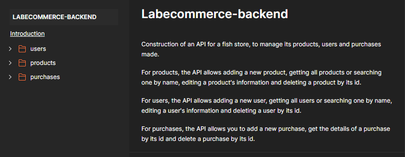
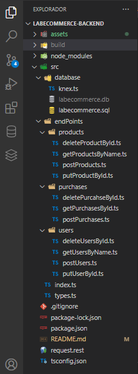

# Labecommerce - Backend

Construction of an API for a fish store, to manage its products, users and purchases made.
<br><br>
For products, the API allows adding a new product, getting all products or searching one by name, editing a product's information and deleting a product by its id.
<br><br>
For users, the API allows adding a new user, getting all users or searching one by name, editing a user's information and deleting a user by its id.
<br><br>
For purchases, the API allows you to add a new purchase, get the details of a purchase by its id and delete a purchase by its id.

## Índice
- <a href="#-Layout">Layout</a>
- <a href="#-Requests">Requests (Paths)</a>
- <a href="#-Example-of-Requests">Example of Requests</a>
- <a href="#-How-to-run-this-project">How to run this project</a>
- <a href="#-Technologies-used">Technologies used</a>
- <a href="#-Demonstration">Demonstration</a>
- <a href="#-Documentation">Documentation</a>
- <a href="#-Developer">Developer</a>
- <a href="#-Next steps">Next steps</a>

## 📸Layout
- Folder structure



## 📌Requests (Paths)

### Users Requests
- /users
### User Requests by name
- /users/userName
### Products Requests
- /users
### Product Requests by name
- /users/productName
### Purchase Requests by id
- /purchases/id

## Example of Requests

### GET/users
- returns all users
```
[
    {
        "id": "u001",
        "name": "Beltrana",
        "email": "beltrana@email.com",
        "password": "beltrana00",
        "createdAt": "2023-07-12 19:57:55"
    },
    {
        "id": "u002",
        "name": "Fulano",
        "email": "fulano@email.com",
        "password": "fulano123",
        "createdAt": "2023-07-12 19:57:55"
    },
    {
        "id": "u003",
        "name": "Astrodev",
        "email": "astrodev@email.com",
        "password": "astRodev99@",
        "createdAt": "2023-07-12 19:57:55"
    },
    {
        "id": "u004",
        "name": "Ciclano",
        "email": "ciclano@email.com",
        "password": "ciclano123456",
        "createdAt": "2023-06-21T19:07:39.259Z"
    },
    {
        "id": "u005",
        "name": "Danielle",
        "email": "danielle123@email.com",
        "password": "Dani123456@",
        "createdAt": "2023-07-12T23:55:11.773Z"
    }
]
```
### GET/users/name
-returns a specific user

```
{
    "id": "u001",
    "name": "Beltrana",
    "email": "beltrana@email.com",
    "password": "beltrana00",
    "createdAt": "2023-07-12 19:57:55"
}
```
### GET/products
- returns all products

```
[
    {
        "id": "p001",
        "name": "mandarim",
        "price": 350,
        "description": "membro da família Callionymidae ou Dragonet e são peixes difíceis de manter devido às suas necessidades de alimentação.",
        "imageUrl": "https://topbiologia.com/wp-content/uploads/2014/07/peixe-mandarim-1.jpg"
    },
    {
        "id": "p002",
        "name": "peixe palhaço",
        "price": 50,
        "description": "são animais de água salgada, oriundos do Pacífico e apresentam tons que variam entre o preto, laranja, amarelo e vermelho",
        "imageUrl": "https://www.petz.com.br/blog/wp-content/uploads/2022/08/peixe-palhaco-e-anemona-final-1280x720.jpg"
    },
    {
        "id": "p003",
        "name": "Blue Tang",
        "price": 500,
        "description": "É o peixe que recebeu o nome de Dori no filme ‘Procurando Nemo'. Membros desta espécie podem viver sozinhos, em pares ou em pequenos grupos de dez a doze indivíduos.",
        "imageUrl": "https://www.universodoaquario.com.br/image/cache/catalog/peixes/peixes-agua-salgada/peixes-hepatus-blue-tang-p-500x500.jpg"
    },
    {
        "id": "p004",
        "name": "FOX FACE",
        "price": 800,
        "description": "Este peixe tem a capacidade de mimetização, mudando de cor e tornando-se marron castanho ou oliva com grandes manchas mais escuras para se parecer com as rochas do aquário quando dorme ou quando está estressado",
        "imageUrl": "https://www.universodoaquario.com.br/image/cache/catalog/peixes/peixes-agua-salgada/fox-face-medio-500x500.jpg"
    },
    {
        "id": "p005",
        "name": "YELLOW TANG",
        "price": 2000,
        "description": "é uma espécie de peixe da família Acanthuridae e muito popular entre os aquaristas. É originário do Havaí e alimenta-se de algas, artêmia e flocos.O cirurgião-amarelo tem um ferrão na cauda para sua defesa",
        "imageUrl": "https://www.universodoaquario.com.br/image/cache/catalog/peixes/peixes-agua-salgada/peixes-yellow-tang-m-500x500.jpg"
    },
    {
        "id": "p006",
        "name": "TUBARÃO BANDED",
        "price": 2200,
        "description": "Enquanto a maioria dos tubarões é grande demais para um aquário doméstico, o tubarão de bambu é uma exceção à regra. Com cerca de 41 polegadas de comprimento, pode ser mantido em um grande tanque de 180 galões junto com outros peixes compatíveis, e muitas vezes se dá bem em cativeiro.",
        "imageUrl": "https://www.universodoaquario.com.br/image/cache/catalog/Tubar%C3%A3o%20Banded-500x500.png"
    }
]
```
### GET/products/name
-returns a specific product

```
{
    "id": "p002",
    "name": "peixe palhaço",
    "price": 50,
    "description": "são animais de água salgada, oriundos do Pacífico e apresentam tons que variam entre o preto, laranja, amarelo e vermelho",
    "imageUrl": "https://www.petz.com.br/blog/wp-content/uploads/2022/08/peixe-palhaco-e-anemona-final-1280x720.jpg"
}
```
### GET/purchases/id
-returns a specific purchase

```
{
    "purchaseId": "o013",
    "buyerId": "u002",
    "buyerName": "Fulano",
    "buyerEmail": "fulano@email.com",
    "totalPrice": 2500,
    "createdAt": "2023-07-11 22:22:25",
    "products": [
        {
            "id": "p004",
            "name": "FOX FACE",
            "price": 800,
            "description": "Este peixe tem a capacidade de mimetização, mudando de cor e tornando-se marron castanho ou oliva com grandes manchas mais escuras para se parecer com as rochas do aquário quando dorme ou quando está estressado",
            "imageUrl": "https://www.universodoaquario.com.br/image/cache/catalog/peixes/peixes-agua-salgada/fox-face-medio-500x500.jpg",
            "quantity": 2
        },
        {
            "id": "p003",
            "name": "Blue Tang",
            "price": 500,
            "description": "É o peixe que recebeu o nome de Dori no filme ‘Procurando Nemo'. Membros desta espécie podem viver sozinhos, em pares ou em pequenos grupos de dez a doze indivíduos.",
            "imageUrl": "https://www.universodoaquario.com.br/image/cache/catalog/peixes/peixes-agua-salgada/peixes-hepatus-blue-tang-p-500x500.jpg",
            "quantity": 1
        },
        {
            "id": "p001",
            "name": "mandarim",
            "price": 350,
            "description": "membro da família Callionymidae ou Dragonet e são peixes difíceis de manter devido às suas necessidades de alimentação.",
            "imageUrl": "https://topbiologia.com/wp-content/uploads/2014/07/peixe-mandarim-1.jpg",
            "quantity": 3
        }
    ]
}
```
## 💻 How to run this project
- If you want to download and install this project on your computer, you need to have git and node installed.
### Links: 
✅[Node](https://nodejs.org/en)
<br><br>
✅[Git](https://git-scm.com/)
- After installation, follow the steps below:
```bash
# Copy the link below

https://github.com/BrunoNMoura/labecommerce-backend

# Open a terminal and type the following command

git clone (paste the url here)

# access the created page

cd labecommerce-backend

# install the dependencies

npm install
or
yarn install

# Executing the Project

npm run start
or 
yarn start
```

## 🛠 Technologies used
✅[Node.js](https://nodejs.org/en)
<br>
✅[TypeScript](https://www.typescriptlang.org/)
<br>
✅[Express](https://expressjs.com/pt-br/)
<br>
✅[SQL](https://learn.microsoft.com/pt-br/sql/?view=sql-server-ver16)
<br>
✅[SQLite](https://www.sqlite.org/docs.html)
<br>
✅[Knex.js](https://knexjs.org/guide/)

## 📺  Demonstration

<video src="assets/README gravação final 2023-07-15 202900.mp4" width="320" height="240" controls> Demonstration video mp4
</video>

## 📚 Documentation
[View Postman-Labcommerce-Backend](https://documenter.getpostman.com/view/26570541/2s93si2Aa1)

## 🏆 Developer

<br>
Bruno Nascimento Moura
<br>
[Linkedin](https://www.linkedin.com/in/bruno-moura-dev/)

## 🪜 Next steps
- Expand the database
- Implement the API in a frontend application